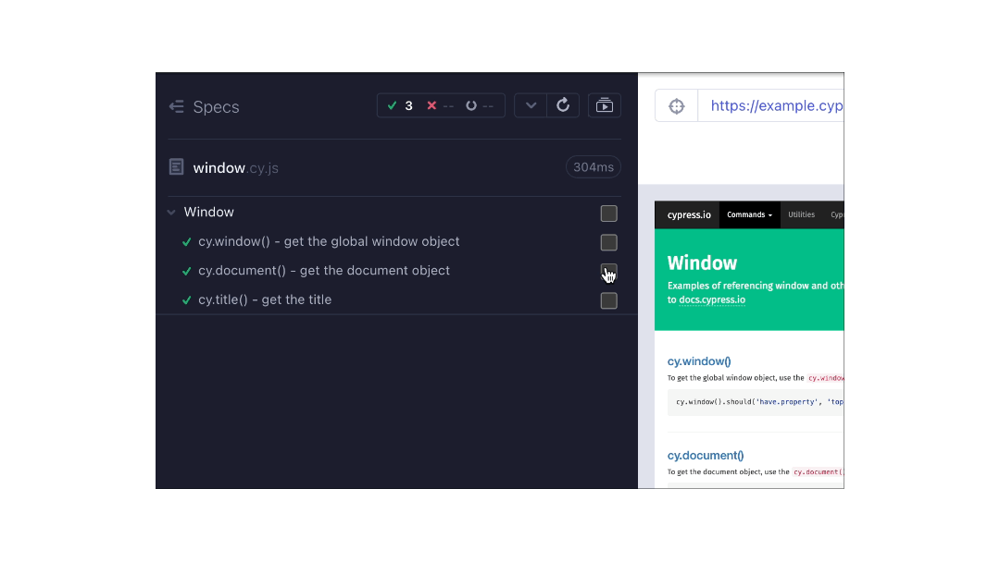
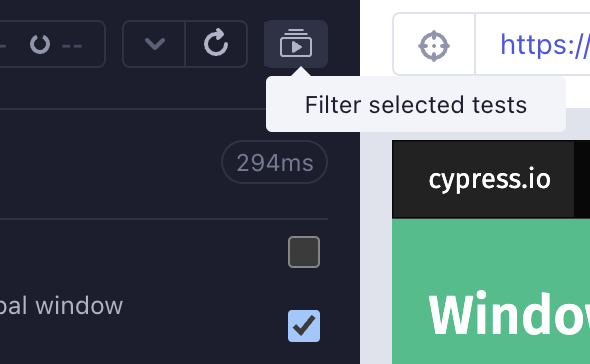

<h2 align=center>Cypress plugin grep-boxes</h2>
<p align="center">
</p>

<p align="center">
A companion Cypress plugin for <code>cy-grep</code> that allows user to run specific test(s) in <code>open</code> mode.
</p>



## Features

- ✅ A new UI test selection within `cypress open` to filter and run only selected tests in a given spec

#### Table of Contents

- [Installation](#-installation)
- [Setup](#-setup)
- [Open mode](#-open-mode)
- [Contributions](#contributions)

---

## 📦 Installation

1. Install the following packages:

```sh
npm install --save-dev @bahmutov/cy-grep # Dependent package for the plugin
npm install --save-dev cypress-plugin-grep-boxes
```

2. In `cypress/support/e2e.js` (For E2E tests) and/or `cypress/support/component.js` (For Component tests),

```js
import { greppedTestToggle, addGrepButtons } from 'cypress-plugin-grep-boxes';

const registerCypressGrep = require('@bahmutov/cy-grep');
registerCypressGrep();

greppedTestToggle();
addGrepButtons();
```

---

## 🦺 Setup

**Recommended**: Set two common environment variables tied to the `@bahmutov/cy-grep` package to enhance the experience utilizing the grep logic within the Cypress Test Runner UI using cypress open:

```json
{
  "env": {
    "grepOmitFiltered": true,
    "grepFilterSpecs": true
  }
}
```

> [!NOTE]
> More information on `grepOmitFiltered` and `grepFilterSpecs` can be read within the [README for `@bahmutov/cy-grep`](https://github.com/bahmutov/cy-grep?tab=readme-ov-file#pre-filter-specs-grepfilterspecs).

## ✅ Open mode

Within each spec, you can select any given number of suite(s) or individual test(s) and click the filter toggle located on the reporter above:



## Contributions

Feel free to open a pull request or drop any feature request or bug in the [issues](https://github.com/dennisbergevin/cypress-plugin-grep-boxes/issues).

Please see more details in the [contributing doc](./CONTRIBUTING.md).
