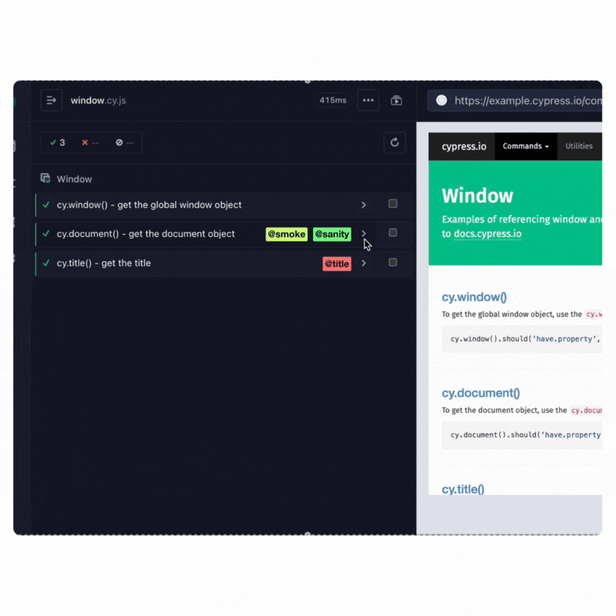
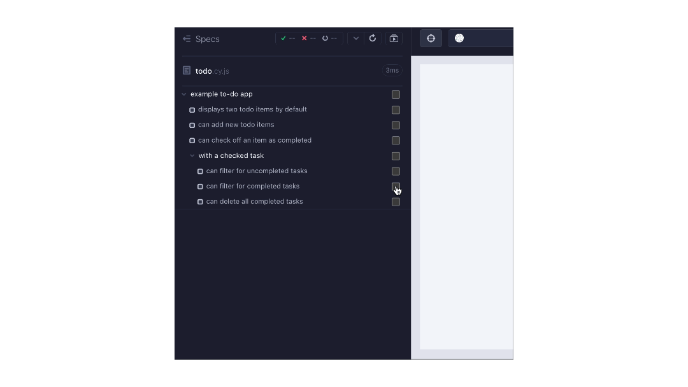

<h2 align=center>Cypress plugin grep-boxes</h2>
<p align="center">
</p>

<p align="center">
A companion Cypress plugin for <code>cy-grep</code> that allows user to run specific test(s) in <code>open</code> mode.
</p>



## Features

- ✅ A new UI test selection within `cypress open` to filter and run only selected tests in a given spec
- 🚩 _NEW_ in v2.0.0: Tags are now displayed and can be clicked to filter by respective tag in `cypress open`

#### Table of Contents

- [Installation](#-installation)
- [Setup](#-setup)
- [Open mode](#-open-mode)
  - [Use Required Test Tags Instead Of Skipping Tests](#use-required-test-tags-instead-of-skipping-tests)
- [disableInitialAutoRun](#disableInitialAutoRun)
- [Contributions](#contributions)

---

## 📦 Installation

1. Install the following packages:

```sh
npm install --save-dev @bahmutov/cy-grep # Dependent package for the plugin
npm install --save-dev cypress-plugin-grep-boxes
```

2. In `cypress/support/e2e.js` (For E2E tests) and/or `cypress/support/component.js` (For Component tests),

> [!IMPORTANT]
> In the plugin version 2.0.0, the `e2e.js` (or `component.js`) support file import has been updated for simplicity:

```js
import 'cypress-plugin-grep-boxes';
import registerCypressGrep from '@bahmutov/cy-grep/src/support';

registerCypressGrep();
```

---

## 🦺 Setup

**Recommended**: Set two common environment variables tied to the `@bahmutov/cy-grep` package to enhance the experience utilizing the grep logic within the Cypress Test Runner UI using cypress open:

```json
{
  "env": {
    "grepOmitFiltered": true,
    "grepFilterSpecs": true
  }
}
```

> [!NOTE]
> More information on `grepOmitFiltered` and `grepFilterSpecs` can be read within the [README for `@bahmutov/cy-grep`](https://github.com/bahmutov/cy-grep?tab=readme-ov-file#pre-filter-specs-grepfilterspecs).

## ✅ Open mode

Within each spec in Cypress `open` mode:

- You can select any given number of individual test(s) and click the filter toggle located on the reporter above
- You can click on any available tag and run only tests in the spec with the respective tag


### Use Required Test Tags Instead Of Skipping Tests

> [!NOTE]
> Read more about this topic within a blog post [Use Required Test Tags Instead Of Skipping Tests](https://glebbahmutov.com/blog/required-tags-instead-of-skipped-tests/) and within the [README for `@bahmutov/cy-grep`](https://github.com/bahmutov/cy-grep#required-tags).

Normally, any Cypress test or suite of tests marked with a `.skip` will be shown when running tests or within the Cypress test runner UI.

Since this plugin uses `@bahmutov/cy-grep` plugin, we can instead designate skipped tests using a **required tag**:

```js
it('deletes an item', { requiredTags: '@skip' }, () => {
  expect(1).to.equal(2);
});
```

Now running or opening Cypress in interactive mode, **you will not see any tests with `requiredTags` including `@skip`** (unless setting environment variable `grepTags=@skip`).

To run just those tests with the required tag `@skip` in interactive mode:

```bash
npx cypress open --env grepTags=@skip
```

## disableInitialAutoRun

Cypress Test Runner UI automatically runs available tests once a spec file is open.

To prevent this behavior to have control of when and which tests to run, add the environment variable `disableInitialAutoRun=true`:



```bash
# Example via CLI
npx cypress open --env disableInitialAutoRun=true
```

**Tip:** you can set this environment variable in the [config file](https://docs.cypress.io/guides/references/configuration) file to enable it by default and skip using the environment variable:

```js
// config file
{
  "e2e": {
    "env": {
      "disableInitialAutoRun": true
    }
  }
}
```

## Contributions

Feel free to open a pull request or drop any feature request or bug in the [issues](https://github.com/dennisbergevin/cypress-plugin-grep-boxes/issues).

Please see more details in the [contributing doc](./CONTRIBUTING.md).
